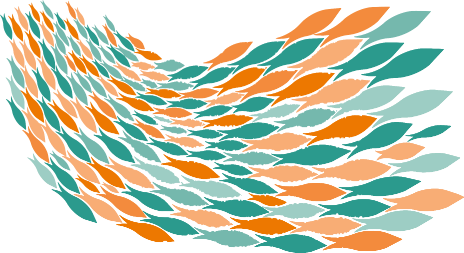

# Shoal
[![language][code-shield]][code-url]
[![language-top][code-top]][code-url]
![code-size][code-size]
[![release][release-shield]][release-url]
[![license][license-shield]][license-url]
[![discord][discord-shield]][discord-url]

Split your data into separate groups to perform computations such as `sum`, `min`, `max`, `count`, etc.... for better analysis.

## Usage

Create the data frame object from a collection of object or an entity selection:

```4d
$collection:=New collection(\
New object("letter"; "A"; "value"; 1); New object("letter"; "B"; "value"; 2); New object("letter"; "C"; "value"; 3); \
New object("letter"; "A"; "value"; 4); New object("letter"; "B"; "value"; 5); New object("letter"; "C"; "value"; 6))

$dataFrame:=shoal.frame($collection)
```

Then group by choosing a column and apply aggregate functions on columns/fields:

```4d
$result:=$dataFrame.groupBy("letter").agg(ƒ.sum("value"); ƒ.max("value").as("maxValue"))
```

```json
{
 "A": {"value":5, "maxValue":4},
 "B": {"value":7, "maxValue":5},
 "C": {"value":9, "maxValue":6}
}
```

with `ƒ` the functions builder that you can instanciate one time.

```4d
ƒ:=shoal.functions()
```

### Flatten result ie. return a new data frame

You could get result as new data frame by calling `flatten`

```4d
$result:=$dataFrame.groupBy("letter").flatten().agg(ƒ.sum("value"); ƒ.max("value").as("maxValue"))
```

Useful to preserve column name and value type used by `groupBy` operation and to apply new operations

```json
{
    "data": [
        { "letter": "A", "value":5, "maxValue":4},
        { "letter": "B", "value":7, "maxValue":5},
        { "letter": "C", "value":9, "maxValue":6}
    ]
}
```

## List of functions

|Name|Description|
|-|-|
|ƒ.sum| the sum|
|ƒ.sumDistinct| the sum of distinct element|
|ƒ.min| the minimum|
|ƒ.max| the maximum|
|ƒ.avg (or ƒ.mean)| the average|
|||
|ƒ.first| the first element|
|ƒ.last| the last element|
|||
|ƒ.count| the number of not NULL elements|
|ƒ.countDistinct| the number of distinct and not NULL elements|
|ƒ.col| all values|
|ƒ.set| distinct values|

## column name alias

Use `as` to rename the column in final result. 

```4d
 .agg(ƒ.sum("value").as("SumOfValue")
```

⚠️ Mandatory if you make multiple computations for the same column (because column name is used as default)

## compute on only one column

It it exists some shortcut to apply function on only one column without using `.agg` 

```4d
$result:=$dataFrame.groupBy("letter").sums("value")
```

> sums, counts, minimums, maximums, etc...

## Get info on data frame

Is it empty?

```4d
$dataFrame.isEmpty
```

Data length ie. row count ?

```4d
$length:=$dataFrame.length
```

Get the number of `cols` and `rows` as object

```4d
$shape:=$dataFrame.shape 
```

Return a new dataframe with some stats on each columns

```4d
$summary:=$dataFrame.summary()
```

## Install

### Manually

Download database and put it in your `Components` folder or copy all code

### With [kaluza-cli](https://mesopelagique.github.io/kaluza-cli/) on macOS

Inside your database root path using the terminal

```bash
# kaluza init # (if never done before)
kaluza install mesopelagique/Shoal
```

## TODO

- [X] support selection
- [X] result into a collection (DataFrame) instead of object (ie. have different way to output grouped data)
- [ ] more functions (standard deviation and variance, skewness, kurtosis, ..., first not null, last not null) = implement it or request to be implemented by 4D (with more efficiency)
- [ ] multiple columns group by
- [ ] limit `summary` to specific columns
- [ ] concatenate columns and create new data frame

>  Shoal of fish 

## Other components

[](https://mesopelagique.github.io/)

<!-- MARKDOWN LINKS & IMAGES -->
<!-- https://www.markdownguide.org/basic-syntax/#reference-style-links -->
[code-shield]: https://img.shields.io/static/v1?label=language&message=4d&color=blue
[code-top]: https://img.shields.io/github/languages/top/mesopelagique/Shoal.svg
[code-size]: https://img.shields.io/github/languages/code-size/mesopelagique/Shoal.svg
[code-url]: https://developer.4d.com/
[release-shield]: https://img.shields.io/github/v/release/mesopelagique/Shoal
[release-url]: https://github.com/mesopelagique/Shoal/releases/latest
[license-shield]: https://img.shields.io/github/license/mesopelagique/Shoal
[license-url]: LICENSE.md
[discord-shield]: https://img.shields.io/badge/chat-discord-7289DA?logo=discord&style=flat
[discord-url]: https://discord.gg/dVTqZHr
